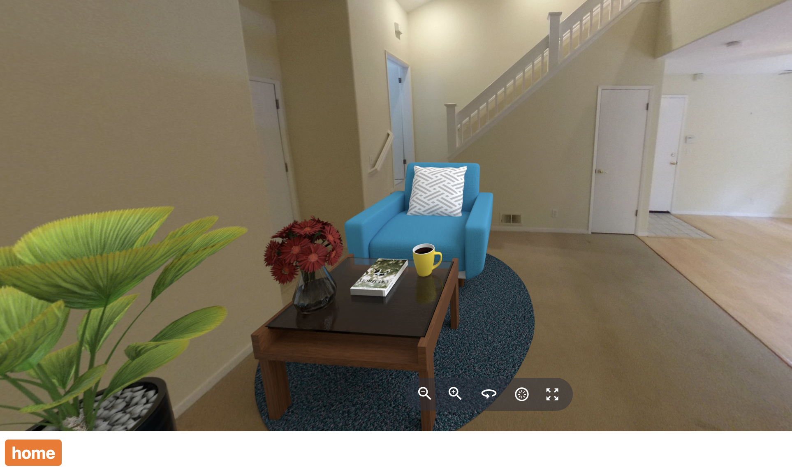

# Image Transformations From RICOH360 Cloud API

You can perform transformations directly with the RICOH
Cloud API and display it in the viewer.

This example shows different staging transformations.

