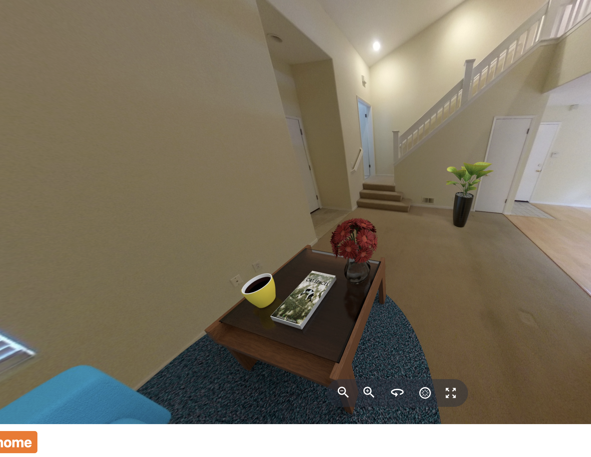

# Image Transformations From RICOH360 Cloud API

You can perform transformations directly with the RICOH
Cloud API and display it in the viewer.

This example shows different staging transformations.

## process

1. generate viewer token and save in app for duration of session or specified time
1. generate content token and save in app
1. get content_id from RICOH360 Cloud using content token
1. pass content_id and viewer token to RICOH360 Viewer to start or switchScene

## Cloud API enhancement

The most popular API is enhancement.  There are three different types of
enhancement. The enhancement in the RICOH360 Viewer API is for automatic
selection.  You can get more control of the enhancement by accessing
the Cloud API directly.

